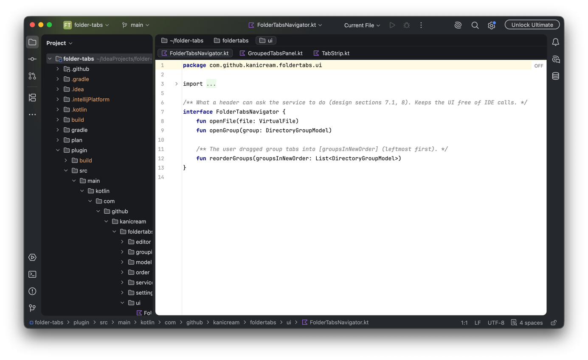
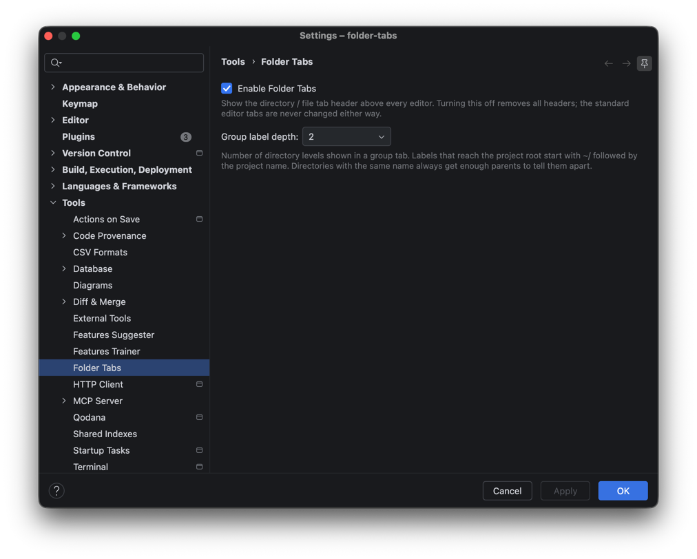
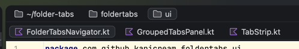
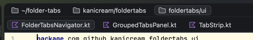

# Folder Tabs

[](https://plugins.jetbrains.com/plugin/33711-folder-tabs)

Groups your open editor tabs by directory. A two-row header sits above every
editor: the upper row lists the directories of the files you have open, the
lower row lists the files of the selected directory.



```
[ 📁 api/users ]  [ 📁 api/orders ]  [ 📁 docs ]
controller.go | *model.go | service.go
----------------------------------------------
Editor
```

Folder Tabs leaves the standard editor tabs untouched and uses only stable
IntelliJ Platform APIs. Use it next to the standard tabs, or hide those with
`Settings > Editor > General > Editor Tabs > Tab placement: None` and make
Folder Tabs your main tab UI.

## Features

- **Directory groups**: one group per parent directory, no guessing of
  "feature" directories. Same-name directories (`api/users`, `admin/users`)
  are always shown with enough of their path to tell them apart.
- **Group label depth**: choose how many path segments a group shows
  (`1`–`5` or `Project root`, default `2`). Labels that reach the project root
  read `~/<project>/…`.
- **Fast switching**: click a group to return to the file you last used there;
  click a file to open it in the normal editor.
- **Close from the header**: every file tab has the standard close button and a
  right-click *Close* entry; a group tab's right-click menu offers *Close
  Group* (all files of that directory). So the header works on its own with
  *Tab placement: None*. Closing goes through the IDE's own *Close Editor*
  action, so with split editors only the pane you clicked in is affected.
- **Reorder groups** by drag & drop; the order is remembered per project.
- **Stays in sync** with open / close / selection and with rename, move and
  delete — without reacting to unrelated VFS churn (Git checkout, builds).
- **At a glance**: the selected tab gets the same blue underline as the standard
  editor tab (only the focused split pane is highlighted), file
  type icons, a `*` marker on modified files, full-path tooltips, single-row
  tabs with an overflow dropdown.
- **Safe**: works with split editors, scratch and non-project files, light and
  dark themes; can be turned off in `Settings > Tools > Folder Tabs`.

## Installation

Install from the [JetBrains Marketplace](https://plugins.jetbrains.com/plugin/33711-folder-tabs):
`Settings > Plugins > Marketplace`, search for **Folder Tabs**, and click *Install*.

## Requirements

IntelliJ IDEA 2026.2.x (plugin builds `262.*`). The plugin depends only on
`com.intellij.modules.platform`, so other JetBrains IDEs on the 2026.2 platform should
work, but only IntelliJ IDEA is verified. Newer platform versions are enabled after the
Plugin Verifier and a manual check pass.

## Settings

`Settings > Tools > Folder Tabs`



| Setting | Default | Meaning |
|---|---|---|
| Enable Folder Tabs | on | Show the header above every editor |
| Group label depth | 2 | Path segments shown in a group tab (`Project root` = full path from the project root) |

Group label depth `1` vs `2` for the same open files:

| depth 1 | depth 2 |
|---|---|
|  |  |

## Not in scope (by design)

Folder Tabs does not pin or move files, has no *Close Others* and no
middle-click close, and it never changes the standard editor tabs or your IDE
settings. The IDE's own actions (`Cmd/Ctrl+W`, pin, etc.) keep working
as usual.

## Development

```
./gradlew build          # compile + tests
./gradlew runIde         # sandbox IDE with the plugin
./gradlew :plugin:verifyPlugin   # Plugin Verifier (API stability gate)
tools/api_audit.py <ide-dir> <fqcn>...   # list @Deprecated / @ApiStatus members
```

CI runs build, tests, plugin structure checks and the Plugin Verifier on every
PR; deprecated, experimental, internal and scheduled-for-removal API usages are
build failures. Releases to JetBrains Marketplace are done manually.

Design documents live in [`plan/`](plan/).

## License

[Apache License 2.0](LICENSE)
